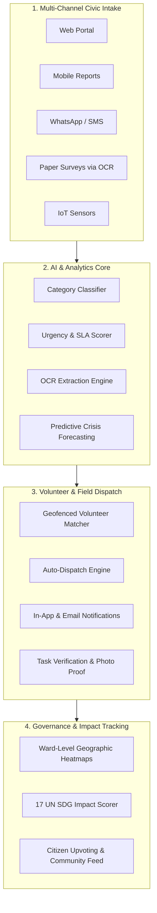

# 🤝 JanSahay (जनसहाय) — AI-Powered Civic Intelligence & Action Platform

[](https://nodejs.org/)
[](https://react.dev/)
[](https://vitejs.dev/)
[](https://www.mongodb.com/)
[](https://tesseract.projectnaptha.com/)
[](https://tailwindcss.com/)
[](#-automated-testing)

> **JanSahay** (*"People’s Support"*) is a comprehensive, full-stack civic intelligence platform that empowers citizens, grassroots NGOs, and municipal administrations to rapidly capture, prioritize, and resolve community crises—from contaminated drinking water and broken roads to medical shortages and power outages.

---

## 🌟 Key Highlights

- **⚡ Zero-Config Startup**: Built-in automatic fallback to an embedded in-memory MongoDB database—run immediately without configuring external databases.
- **📄 Paper-to-Digital OCR**: Scan and extract handwritten or printed paper field surveys directly into structured digital issues using Tesseract.js.
- **🤖 Autonomous AI Auto-Dispatch**: Matches community issues to registered volunteers based on verified skills, geographic proximity (geofence), and workload balance.
- **🎯 17 UN SDG Impact Tracking**: Quantifies grassroots resolutions against all 17 United Nations Sustainable Development Goals with real-time scoring.
- **🔮 Ward-Level Crisis Forecasting**: Predictive algorithms detect emerging crisis hotspots before they escalate.

---

## 📑 Table of Contents

1. [System Architecture](#-system-architecture)
2. [Core Feature Matrix](#-core-feature-matrix)
3. [Quick Start & Running Locally](#-quick-start--running-locally)
4. [Demo Accounts & Credentials](#-demo-accounts--credentials)
5. [Automated Testing](#-automated-testing)
6. [API Documentation](#-api-documentation)
7. [Directory Structure](#-directory-structure)
8. [Production Deployment & Environment Variables](#-production-deployment--environment-variables)
9. [Tech Stack](#-tech-stack)

---

## 🏗 System Architecture



---

## 🚀 Core Feature Matrix

### 1. 📄 AI/OCR Paper Survey Scanner
* **Problem**: Field workers in rural or low-connectivity areas often collect feedback on physical paper clipboards.
* **Solution**: An integrated **Tesseract.js** OCR engine with image preprocessing and rotation correction.
* **Extraction**: Automatically extracts **Title**, **Description**, **Category**, **Ward**, **Area**, and **Affected Count** from photos of paper survey forms and registers them as verified reports.

### 2. 🧠 Urgency & SLA Prioritization Engine
* Calculates a deterministic **Urgency Score (0–100)** factoring in:
  - Base category risk (Water & Health = highest).
  - Vulnerability multipliers (keywords: `children`, `infant`, `elderly`, `hospital`, `school`).
  - Total population affected (logarithmic scaling).
  - Social verification (citizen upvotes).
* Automatically assigns SLA resolution targets:
  - **CRITICAL (Score ≥ 75)**: 12-hour resolution SLA.
  - **HIGH (Score 50–74)**: 24-hour resolution SLA.
  - **MEDIUM (Score 25–49)**: 48-hour resolution SLA.
  - **LOW (Score < 25)**: 72-hour resolution SLA.

### 3. ⚡ Autonomous Volunteer Matcher & Dispatch
* Evaluates volunteers against a composite score:
  - **Skill Alignment (40%)**: Matches required skills (e.g., `medical`, `electrical`, `plumbing`, `rescue`).
  - **Proximity Score (35%)**: Calculates distance using Haversine GPS coordinates.
  - **Availability & Rating (25%)**: Prioritizes highly rated, unburdened volunteers.
* Supports **One-Click Auto-Dispatch All** to immediately mobilize teams across an entire municipality.

### 4. 🌐 17 UN Sustainable Development Goals (SDG) Tracker
* Automatically categorizes civic actions against UN SDG targets:
  - **SDG 3**: Good Health & Well-being
  - **SDG 6**: Clean Water & Sanitation
  - **SDG 7**: Affordable & Clean Energy
  - **SDG 9**: Industry, Innovation & Infrastructure
  - **SDG 11**: Sustainable Cities & Communities
  - **SDG 13**: Climate Action
* Provides dynamic goal scores, trend percentages, and total citizen outreach metrics.

### 5. 🔮 Predictive Crisis Map
* Analyzes historical frequency and seasonal factors (e.g., monsoon drainage overflow, summer water scarcity).
* Flags wards as **Stable**, **At Risk**, or **Imminent Crisis** with statistical confidence intervals.

### 6. 🛡 Zero-Downtime Database Resilience
* Attempts connection to primary MongoDB (local or Atlas).
* If unavailable, **automatically boots `mongodb-memory-server`** and populates 20+ realistic demo reports, active volunteers, and admin accounts without manual intervention.

---

## 💻 Quick Start & Running Locally

### Prerequisites
- [Node.js](https://nodejs.org/) v18.0.0 or higher
- Git

### 1. Clone & Setup
```bash
git clone https://github.com/dikshadewangan21/jansahay-project.git
cd jansahay-project
```

### 2. Run the Backend API
```bash
cd backend
npm install
node index.js
```
> The backend server starts at **`http://localhost:5000`**.  
> If no MongoDB server is detected, it will automatically spin up an embedded in-memory database with pre-loaded demo data.

### 3. Run the Frontend Web App
In a new terminal window:
```bash
cd frontend
npm install
npm run dev
```
> The frontend web app opens at **`http://localhost:5173`**.

---

## 🔑 Demo Accounts & Credentials

The database comes pre-seeded with ready-to-test accounts:

| Role | Email | Password | Access Capabilities |
| :--- | :--- | :--- | :--- |
| **Administrator** | `admin@demo.in` | `demo1234` | Full access: AI Dispatch, Ward Heatmaps, Volunteer Management, SDG Analytics |
| **Field Volunteer** | `vol@demo.in` | `demo1234` | Task board, accepting missions, status updates, photo verification |
| **Public / Citizen** | *Unauthenticated* | *N/A* | Submit civic complaints, upload paper surveys, upvote issues |

---

## 🧪 Automated Testing

JanSahay includes an end-to-end integration test suite verifying all routes, database operations, AI dispatching, and OCR processing.

To run the verification suite:
```bash
cd backend
node test-suite.js
```

### Test Coverage (17 / 17 Passing):
- [x] API Health & System Status (`GET /health`)
- [x] Authentication & JWT Validation (`POST /api/auth/login`)
- [x] Protected Identity Fetching (`GET /api/auth/me`)
- [x] Multi-Filter Civic Report Queries (`GET /api/reports`)
- [x] Community Issue Creation & Urgency Calculation (`POST /api/reports`)
- [x] Citizen Upvoting Pipeline (`POST /api/reports/:id/vote`)
- [x] Volunteer Directory & Availability (`GET /api/volunteers`)
- [x] Task Management with Populated Relations (`GET /api/tasks`)
- [x] Municipal Dashboard Aggregations (`GET /api/dashboard/stats`)
- [x] Need-Graph & Crisis Forecasting (`GET /api/dashboard/need-graph`)
- [x] Ward Crisis Prediction Algorithms (`GET /api/ai/crisis-predictions`)
- [x] Intelligent Recommendation Engine (`GET /api/ai/recommend/:id`)
- [x] Automated Volunteer Dispatch (`POST /api/ai/dispatch/:id`)
- [x] Global Auto-Dispatch Pipeline (`POST /api/ai/auto-dispatch-all`)
- [x] Real-Time SDG Impact Scoring (`GET /api/sdg/scores`)
- [x] Volunteer Push Notifications (`GET /api/notifications`)
- [x] Paper Survey Tesseract OCR Processing (`POST /api/reports/ocr`)

---

## 📡 API Documentation

### Authentication (`/api/auth`)
| Method | Endpoint | Description | Auth Required |
| :--- | :--- | :--- | :--- |
| `POST` | `/login` | Authenticate user & receive JWT | No |
| `POST` | `/register` | Register new citizen or volunteer | No |
| `GET` | `/me` | Get currently authenticated profile | Yes (Bearer Token) |

### Community Reports (`/api/reports`)
| Method | Endpoint | Description | Auth Required |
| :--- | :--- | :--- | :--- |
| `GET` | `/` | List all reports (filterable by status, urgency, category) | No |
| `POST` | `/` | Submit a new civic complaint | No |
| `GET` | `/:id` | Get report details with history | No |
| `POST` | `/:id/vote` | Upvote a community report | No |
| `POST` | `/ocr` | Upload a paper survey image to extract and save | No |

### AI Engine & Dispatch (`/api/ai`)
| Method | Endpoint | Description | Auth Required |
| :--- | :--- | :--- | :--- |
| `GET` | `/recommend/:reportId` | Generate prioritized action plan for a report | Yes |
| `POST` | `/dispatch/:taskId` | Auto-match and assign top volunteers to a task | Yes |
| `POST` | `/auto-dispatch-all` | Batch auto-dispatch all pending unassigned tasks | Yes |
| `GET` | `/crisis-predictions` | Forecast ward-level crisis risk and probabilities | Yes |

### Field Tasks & Execution (`/api/tasks`)
| Method | Endpoint | Description | Auth Required |
| :--- | :--- | :--- | :--- |
| `GET` | `/` | List all tasks with assigned volunteer details | No |
| `POST` | `/` | Manually create a task from a report | Yes |
| `PATCH`| `/:id/status` | Update progress (`assigned` ➔ `in_progress` ➔ `resolved`) | Yes |

### SDG Analytics & Dashboard (`/api/sdg` & `/api/dashboard`)
| Method | Endpoint | Description | Auth Required |
| :--- | :--- | :--- | :--- |
| `GET` | `/api/sdg/scores` | Retrieve calculated scores across all 17 UN SDGs | No |
| `GET` | `/api/dashboard/stats` | High-level municipal metrics (urgent, resolved, active) | No |
| `GET` | `/api/dashboard/need-graph`| Historical trend chart and demand forecast | No |

---

## 📁 Directory Structure

```
jansahay-project/
├── backend/
│   ├── config/
│   │   ├── database.js          # MongoDB connection with MongoMemoryServer fallback
│   │   ├── logger.js            # Structured logging
│   │   └── index.js             # Environment configuration
│   ├── controllers/             # Express controllers wrapped with asyncHandler
│   │   ├── authController.js
│   │   ├── reportsController.js
│   │   ├── tasksController.js
│   │   ├── volunteersController.js
│   │   └── dashboardController.js
│   ├── middleware/              # Auth, error handling, rate limiting
│   ├── models/                  # Mongoose Schemas (User, Report, Task, Volunteer, SdgImpact)
│   ├── routes/                  # API routers (auth, reports, ai, tasks, volunteers, sdg)
│   ├── services/
│   │   ├── ocrService.js        # Tesseract.js survey image extraction
│   │   ├── volunteerMatcher.js  # Proximity & skill matching engine
│   │   ├── actionRecommender.js # AI action generation
│   │   ├── crisisPredictor.js   # Hotspot forecasting
│   │   ├── urgencyScoring.js    # 0-100 algorithmic urgency scorer
│   │   ├── sdgScorer.js         # 17 UN SDG impact mapping
│   │   └── notificationService.js
│   ├── scripts/
│   │   └── seed.js              # Comprehensive demo dataset seeder
│   ├── test-suite.js            # Automated 17-point integration test suite
│   └── index.js                 # Server entry point
│
├── frontend/
│   ├── public/                  # Static assets & icons
│   ├── src/
│   │   ├── components/          # Reusable UI components (Navbar, TaskCard, ReportCard, etc.)
│   │   ├── context/             # React Context (AuthContext)
│   │   ├── pages/
│   │   │   ├── DashboardPage.jsx    # Municipal overview & live map
│   │   │   ├── SubmitReportPage.jsx # Report submission & OCR survey upload
│   │   │   ├── ReportsPage.jsx      # Citizen feed & filtering
│   │   │   ├── TasksPage.jsx        # Volunteer taskboard & status updates
│   │   │   ├── AIEnginePage.jsx     # AI Dispatch & Recommendations
│   │   │   ├── CrisisMapPage.jsx    # Predictive ward heatmaps
│   │   │   ├── SDGPage.jsx          # UN Sustainable Development Goals tracker
│   │   │   └── LoginPage.jsx        # Auth page
│   │   ├── services/
│   │   │   └── api.js               # Centralized Axios/fetch API client
│   │   ├── App.jsx                  # Route definitions
│   │   └── main.jsx                 # Vite application mount point
│   ├── tailwind.config.js       # Styling configuration
│   └── vite.config.js           # Vite dev & build configuration
│
└── README.md                    # Project documentation
```

---

## 🌐 Production Deployment & Environment Variables

Create a `.env` file inside the `backend/` directory to configure custom credentials:

```env
# Server
PORT=5000
NODE_ENV=production
CORS_ORIGIN=https://your-frontend-domain.com

# Database (Leave blank to use embedded in-memory database)
MONGODB_URI=mongodb+srv://<user>:<password>@cluster0.example.mongodb.net/jansahay?retryWrites=true&w=majority

# Security
JWT_SECRET=your_super_secret_jwt_key_here
JWT_EXPIRES_IN=7d

# Optional Real Email Notifications (SMTP)
SMTP_HOST=smtp.gmail.com
SMTP_PORT=587
SMTP_USER=your-email@gmail.com
SMTP_PASS=your-app-specific-password
EMAIL_FROM="JanSahay Alerts <no-reply@jansahay.org>"
```

---

## 🛠 Tech Stack

| Layer | Technologies |
| :--- | :--- |
| **Frontend** | React 18, Vite 5, Tailwind CSS, Lucide Icons, Leaflet / React-Leaflet, Recharts |
| **Backend** | Node.js, Express 4, Mongoose 8, Helmet, CORS, Morgan |
| **AI / Machine Learning** | Tesseract.js 7 (OCR), Statistical Classifier, Haversine Geofencing, Urgency Matrix |
| **Database** | MongoDB 6+ / MongoDB Atlas with automatic `mongodb-memory-server` fallback |
| **Authentication** | JWT (JSON Web Tokens), Bcrypt.js password hashing |

---

## 📄 License

This project is licensed under the **MIT License**. Built with ❤️ for community governance, NGOs, and citizen empowerment.
